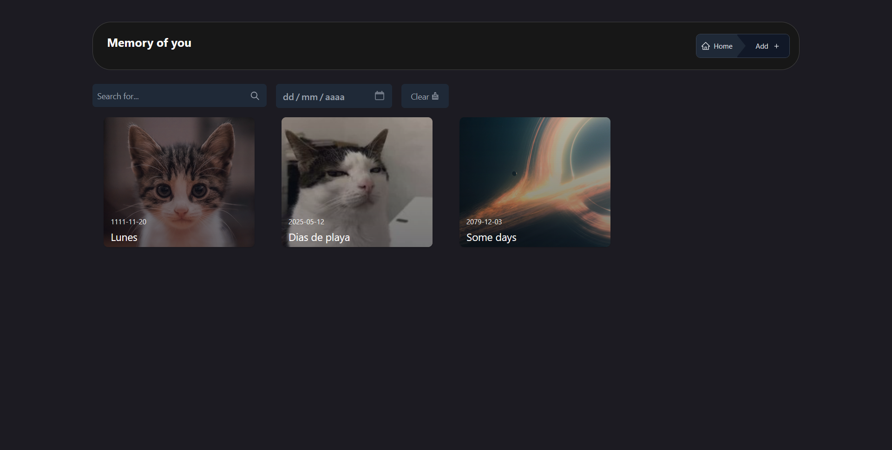

# Memory of You

## Descripción general

Una aplicación de gestión de recuerdos que almacenará los datos en el localStorage, permitiendo a los usuarios guardar, visualizar y administrar recuerdos de manera interactiva. Este proyecto abarcará la implementación de métodos CRUD (Crear, Leer, Actualizar y Eliminar), proporcionando una experiencia completa de desarrollo.

### Screenshot

### Links

- URL del sitio activo: https://memoryofyou00.netlify.app

## Mi proceso

### Construido con

- React 
    - React-icons
    - React-dropzone
    - React-redux
    - React-slick
- Tailwindcss
- vite
